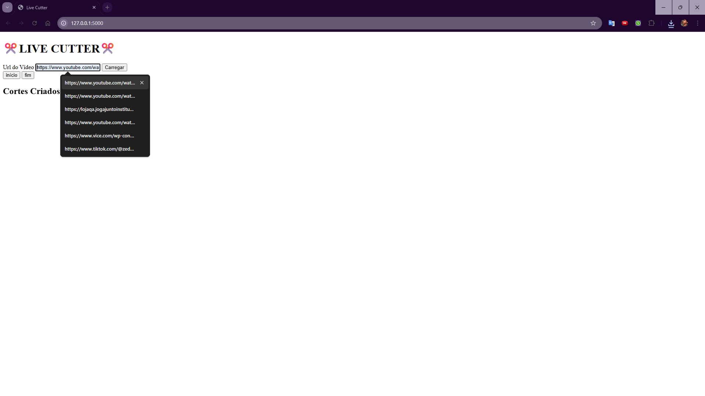
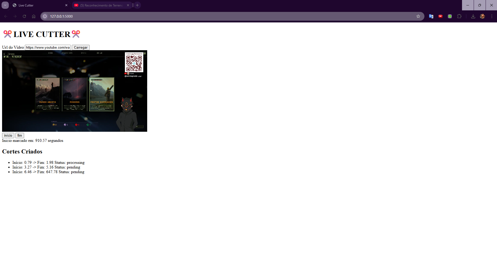

# ✂️ Live Cutter — Documentação (PT-BR)

## Introdução

O **Live Cutter** é um aplicativo local voltado para criadores de conteúdo que precisam **marcar e extrair trechos específicos de vídeos do YouTube** de forma prática e controlada.

O projeto roda **localmente no navegador**, utilizando **Flask** como backend e **HTML/JavaScript** no frontend. Ele não funciona como um serviço online, não hospeda conteúdo e não realiza processamento remoto.

A proposta do Live Cutter é oferecer uma ferramenta simples, direta e previsível: o usuário carrega um vídeo, define os intervalos de interesse e o aplicativo lida com o processamento local desses trechos, respeitando os limites do ambiente do próprio usuário.

Este repositório documenta o **estado atual do projeto**, suas funcionalidades existentes e suas limitações. O desenvolvimento é incremental e orientado por experimentação, com espaço aberto para discussões e contribuições da comunidade.

---

## Funcionalidades (estado atual)

O Live Cutter oferece um fluxo simples e contínuo para marcar trechos de um vídeo e processá-los localmente.

### Fluxo de uso

1. O usuário informa a URL de um vídeo do YouTube.
2. O vídeo é carregado em um player incorporado na interface.
3. Durante a reprodução, o usuário marca manualmente o tempo de **início** e **fim** de um trecho.
4. As informações do corte são enviadas **automaticamente e de forma individual** para o backend.
5. Cada corte é processado localmente conforme é registrado.

### Comportamento atual do sistema

- Os cortes são tratados de forma **sequencial**, um por vez.
- O envio ao backend ocorre sem necessidade de ação adicional do usuário.
- O estado de cada corte é refletido na interface.
- O aplicativo funciona inteiramente no ambiente local do usuário.

### Arquitetura do projeto

O Live Cutter é organizado em camadas simples, com separação clara entre **interface**, **controle de fluxo**, **processamento** e **dados locais**.

> A estrutura abaixo representa a organização do repositório durante o desenvolvimento.  
> A estrutura do executável final difere desta organização.

```
├── 🐍 app.py # ponto de partida do backend Flask
├── 📁 templates
│   └── 🌐 index.html # Estrutura da interface
├── 📁 static
│   ├── 📄 script.js # Lógica do frontend no navegador
│   └── 🎨 style.css # Estilos da interface
├── 📁 engine
│   ├── 🐍 __init__.py
│   └── 🐍 ytfastcut.py # Engine de processamento de cortes
├── 📁 core
│   └── 🐍 app_path.py # Gerenciamento de caminhos e estrutura mínima
├── 📁 cutter
│   ├── 📁 data # dados gerados localmente pelo app
│   │   ├── 📁 cut # Saida dos cortes (rápidos e lentos)
│   │   │   ├── 📁 fast
│   │   │   └── 📁 slow
│   │   ├── 📁 tmp # Download temporário dos arquivos de vídeo .part
│   │   │   ├── 📁 fast
│   │   │   └── 📁 slow
│   │   └── 📁 logs # registros de execução não implementado
│   ├── 📁 essentials # MÓDULOS ESSENCIAIS PARA O FUNCIONAMENTO DO APP - NÃO APAGAR
│   │   └── 📁 bin
├── 📁 assets
│   └── 📁 screenshots imagens usadas na documentação
├── 📁 licenses
│   ├── 📄 LICENSE # licença do projeto
│   └── 📁 Third_Party # Licença de terceiros
│       └── 📄 yt-dlp.LICENCE
├── 📝 README.MD
├── 📝 README.en.md
└── 📝 README.pt-br.md
```


Cada camada do projeto possui um papel bem definido:

- **Interface (`templates/` + `static/`)**  
  Estrutura visual e lógica de interação no navegador.

- **Backend (`app.py`)**  
  Inicializa o servidor local, expõe rotas simples e delega o processamento.

- **Engine (`engine/ytfastcut.py`)**  
  Executa o corte local dos vídeos.

- **Gerenciamento de caminhos (`core/app_path.py`)**  
  Centraliza regras de estrutura e criação de diretórios.

- **Dados locais (`cutter/data/`)**  
  Armazena arquivos gerados e dados temporários.

---

### Backend: organização das rotas e inicialização (`app.py`)

O arquivo `app.py` atua como **ponto de entrada do Live Cutter**. Ele inicializa o servidor local, abre automaticamente a interface no navegador e expõe as rotas utilizadas pelo frontend.

Antes de iniciar o servidor, o aplicativo garante a existência da **estrutura mínima de diretórios**, evitando erros relacionados a caminhos inexistentes.

A rota `/` serve exclusivamente a interface (`index.html`).  
A rota `/cut` recebe dados de um único corte, valida as informações e delega o processamento à engine (`engine/ytfastcut.py`).

O backend:
- não gerencia filas complexas;
- não controla concorrência;
- não mantém estado persistente.

Ele atua apenas como intermediário direto entre interface e processamento.

---

### Interface: estrutura da página (`index.html`)

O arquivo `index.html` define apenas a **estrutura estática da interface**.

Ele organiza:
- cabeçalho;
- formulário de URL;
- área do player;
- botões de marcação;
- lista de cortes criados.

Não há lógica de negócio nem comunicação com o backend nesse arquivo.  
Toda a lógica de interação é delegada ao JavaScript.

---

### Exemplo visual da interface





---

### Lógica do cliente: controle de estado e fila (`static/script.js`)

O arquivo `script.js` concentra toda a lógica do frontend, incluindo controle de estado, fila de cortes e envio automático ao backend.

Ele mantém um estado simples no navegador:
- tempo inicial atual;
- fila de cortes;
- flag de processamento ativo.

O player do YouTube é criado dinamicamente após a inserção de uma URL válida.

#### Formato de URL suportado

Atualmente, o frontend aceita apenas URLs no formato padrão:

https://www.youtube.com/watch?v=VIDEO_ID


Outros formatos (links encurtados, embeds, shorts ou URLs com parâmetros adicionais) **não são suportados neste momento**, embora sejam tecnicamente tratáveis.

Essa limitação existe porque o `video_id` é extraído por operações simples de string, priorizando legibilidade e facilidade de modificação.

#### Envio automático e sequencial

Cada corte criado é enviado automaticamente ao backend, um por vez.

- Apenas um corte é processado por vez.
- Não há paralelismo.
- A fila existe apenas no navegador.
- O estado não é persistido ao recarregar a página.

Essas decisões priorizam simplicidade e previsibilidade.

---

### Processamento local: engine de corte (`engine/ytfastcut.py`)

A engine executa o corte real dos vídeos por meio do `yt-dlp`.

Ela:
- cria diretórios temporários;
- executa o comando de corte;
- aguarda a finalização do download;
- move o arquivo final para o diretório de saída.

O processamento é síncrono e explícito, sem paralelismo ou fallback avançado.

A engine depende diretamente da compatibilidade entre o `yt-dlp` e o YouTube.  
Atualmente não há mecanismo de atualização automática da ferramenta.

---

## Limitações e postura do projeto

O Live Cutter é um projeto em desenvolvimento, com foco em clareza, aprendizado e experimentação.

### Limitações técnicas conhecidas

- Funciona exclusivamente de forma local.
- Processamento sequencial.
- Estado não persistente.
- Suporte limitado a formatos de URL.
- Dependência direta do `yt-dlp`.
- Ausência de atualização automática de dependências.

### Postura do projeto

O Live Cutter:
- não hospeda conteúdo;
- não distribui vídeos;
- não opera como serviço online;
- não valida finalidade de uso;
- não fiscaliza conteúdos.

O uso do aplicativo é de responsabilidade do usuário.  
O projeto é fornecido **como está**, sem garantias explícitas ou implícitas.

---

## 💡 Ideias em aberto

Esta seção reúne ideias e possibilidades para discussão, sem compromisso de implementação.

- Suporte a múltiplos formatos de URL do YouTube.
- Player com iframe responsivo.
- Atualização automática opcional do `yt-dlp`.
- Persistência de estado no frontend.
- Melhor feedback visual de erros e processamento.
- Revisão da arquitetura de processamento.

Sugestões e críticas são bem-vindas, desde que ajudem a manter o projeto simples e compreensível.

---

## Apoio ao projeto

O Live Cutter é um projeto independente, desenvolvido de forma aberta e incremental.

Se este projeto foi útil para você — seja como ferramenta, estudo ou referência técnica — existe a possibilidade de apoiar seu desenvolvimento de forma voluntária.

### 🇧🇷 Apoio no Brasil

No Brasil, o apoio ao projeto é feito por meio do Apoia.se:

- 👉 https://apoia.se/ytclipper

O Apoia.se funciona como a **página oficial de apoio** do projeto, reunindo informações, contexto e formas de contribuição mais conscientes e intencionais.

O apoio é totalmente opcional e não está associado a contrapartidas, promessas de funcionalidades, suporte prioritário ou garantias de atualização.

Mais importante do que o apoio financeiro é a participação em discussões, críticas construtivas e sugestões que ajudem o projeto a evoluir de forma saudável.


---

## Licença

Este projeto é distribuído sob a **licença MIT**.

- [`licenses/LICENSE`](licenses/LICENSE)

O projeto utiliza componentes de terceiros.  
As licenças correspondentes estão documentadas em:

- [`licenses/Third_Party/`](licenses/Third_Party/)
